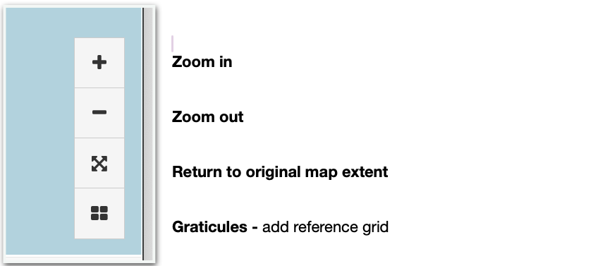
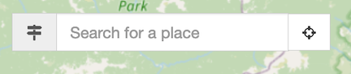
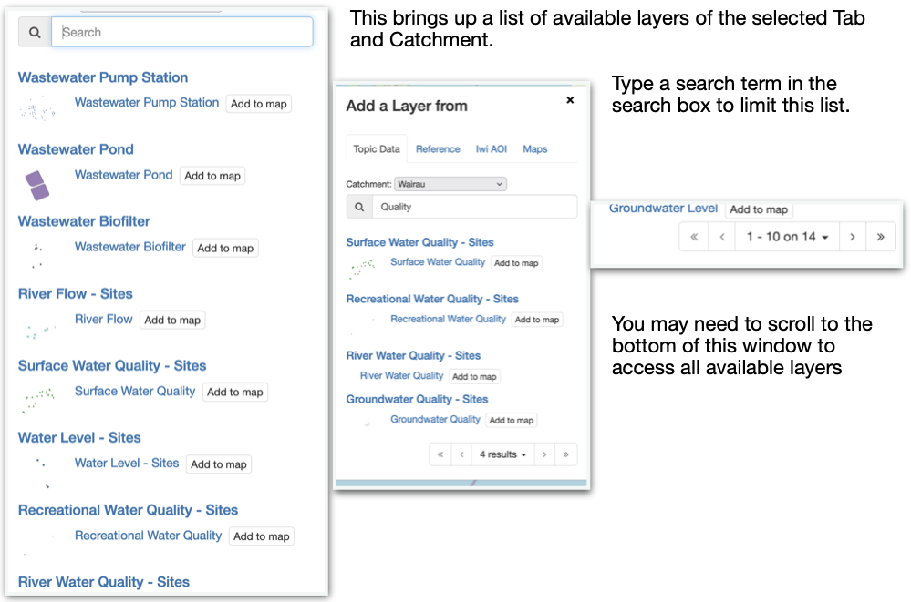
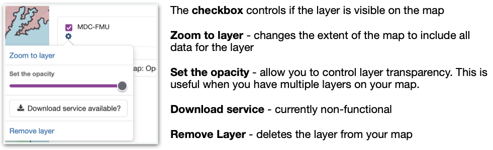
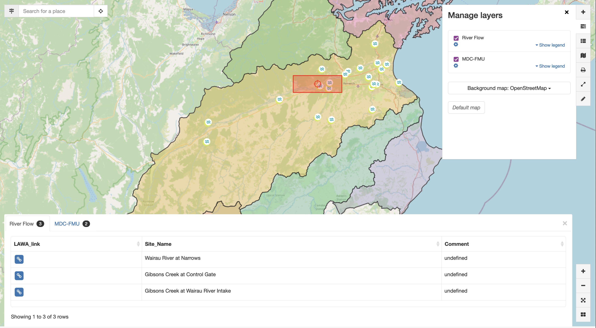
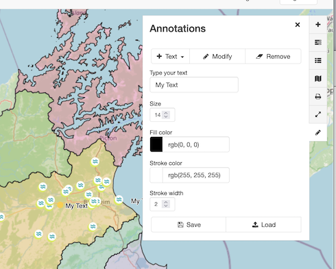

## Accessing the site -

In your browser, go to -
[https://temanaotewai.geodata.nz/](https://temanaotewai.geodata.nz/)

To get this (temporary) landing page
-

Click "[Continue to
map](https://temanaotewai.geodata.nz/geonetwork/srv/eng/catalog.search#/map)\"

This brings you to the main site
-

## Main Page Controls -

In the upper right are the main controls

## Navigation Controls -

In the Lower right hand corner are controls for navigating the map.

## Address Search -

In the upper left corner is a tool for searching by place name or address

# Using the map

## Adding layers

Clicking the Add Layers button brings up this menu Whis=ch is used to add data to your map

Topic Data and Reference Data are sorted by catchment, These include watersheds and council boundaries. (To be reviewed and added to.)

To add data, click on "**Search**"

Click "Add to map" button on the desired layer to your map.

## Mange layers -

Once data is added to your map the Manage layers window
appears

This window can also be accessed by clicking "Layers" button.

Clicking the gear icon under the layer name helps you control the
layer 

## Query data -

Layers added to the map can be queried by clicking or dragging a box over an area.while holding down the control key

When an blue link icon is included in the flyer information panel, this can be clicked to access external information about a selected feature.

## Legend -

A map legend can be displayed by selecting the legend button.

## Print map -

To print the current map, click the "Print" button

Unblocking the "Auto" box under "Scale" allows you to from more or less of the map to print.

## Annotations -

You can add annotations to your map in the form of points, lines polygons and text with the "annotation" button.

These annotations do not save to the Geodatabase, but can be saved to your printable maps. Future users will not be able to see these annotations when the view data on the web map.

# Available Data

Layers available to query and view change at intervals according to need and access. Current available data layers are described here

## Iwi AOI layers -

Twenty layers are currently available that delineate areas of interest for all of the Te Tauihu Iwi. These are primarilly of two types, Statutory Acknowledgement Areas (SAA) and Rohe boundaries. One each for each of the nine Te Tauihu Iwi. These layers can be added to the map by clicking the "Add" button (+), selecting the Iwi AOI tab and clocking "**Seach**"

## Reference data layers -

Reference data is sorted by catchment selected. Currently the web map hold data for three catchment areas - the Wairau river drainage in Marlborough, the Mahi Tahi (Maimai) river drainage in Nelson and area of the Tasman District Council.

Wairua streams - centreline data for all rivers and streams in the
Wairau catchment

Wairau Catchment - A reverse shading of the Wairau catchment layer (non
Wairua catchments are shaded)

Wairau River Polygons - Larger rivers and streams shown as polygon
features (from LiNZ Topo data)

Wairau Lake Polygons - Lakes and other large water bodies shown as
polygon features (from LiNZ Topo data)

MDC-WMU
